# 时光 · Days Remember

A multilingual anniversary and countdown app built with SwiftUI, iOS 17+. Native tabs, a photo-led day feed, monthly agenda, custom categories, reminders, share cards, and WidgetKit layouts share one visual system. The original prototype remains in `_design/days-remember/` as a historical reference.

## Screenshots

App Store screenshots for the 6.9-inch iPhone slot (1320 × 2868 JPEG, no alpha channel) live in `docs/screenshots/<language>/`: home, day detail, calendar, widget preview, share card, and categories. `bash scripts/screenshots.sh` regenerates all three languages on a disposable iPhone 17 Pro Max, with translated sample days and today pinned to 2026-04-23 (the calendar to 2026-07-08, so the month has days in it). The detail, widget, and share screens are opened directly and therefore show no tab bar.

`bash scripts/promo-video.sh` draws a promotional video from the Simplified Chinese screenshots and the cover illustrations: 9:16 (1080 × 1920), 30 fps, about 28 seconds, silent, with Chinese captions. It writes `build/promo/days-remember-promo-zh-Hans.mp4` and a contact sheet with one frame per second; add music in an editor before posting.

**简体中文**

<p>
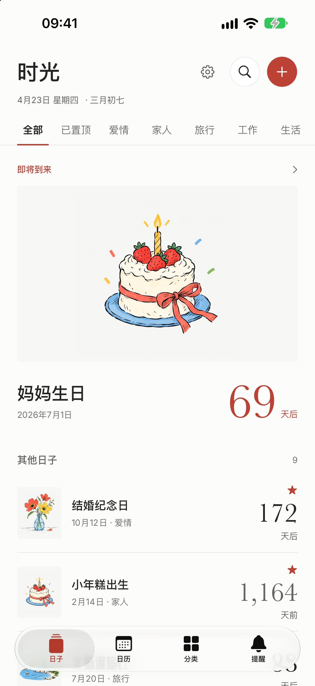
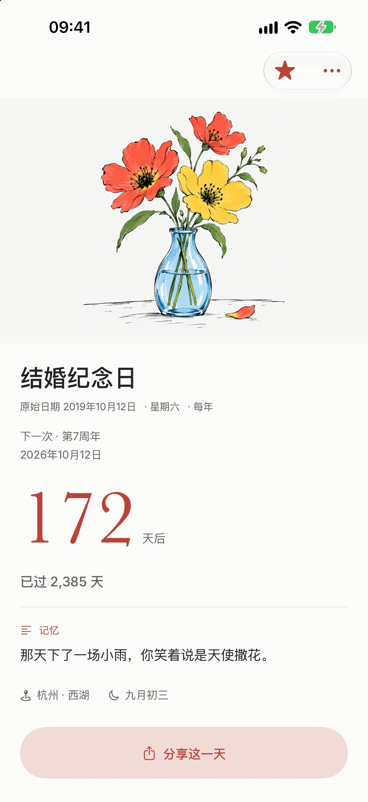
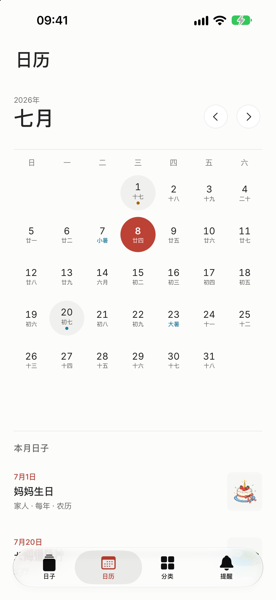
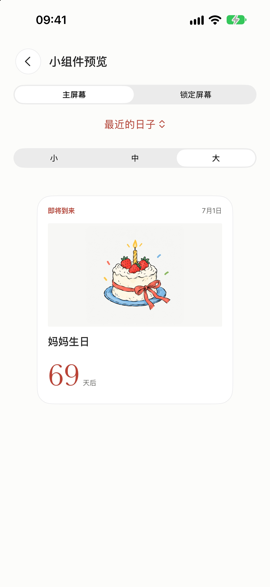
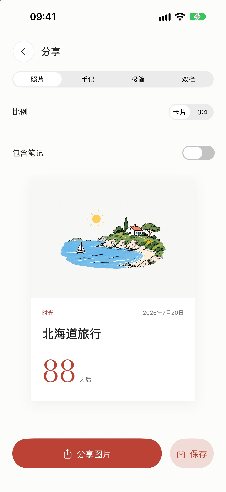
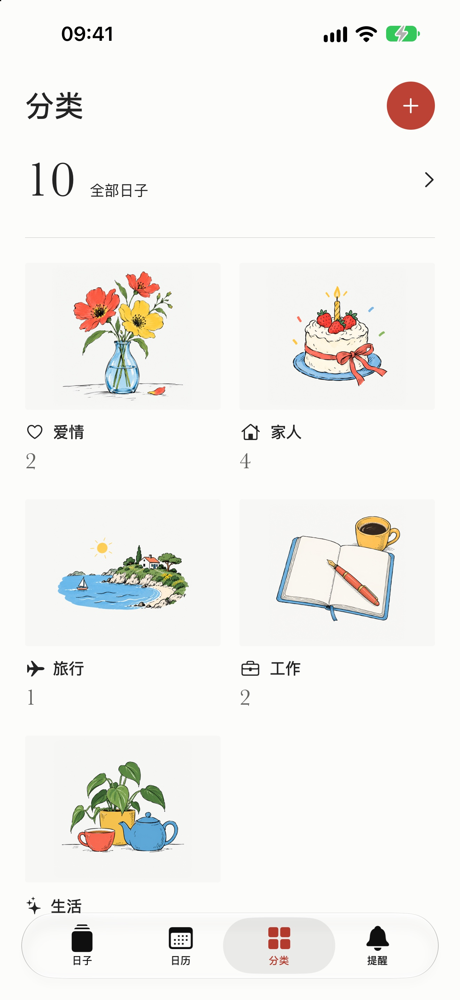
</p>

**繁體中文**

<p>
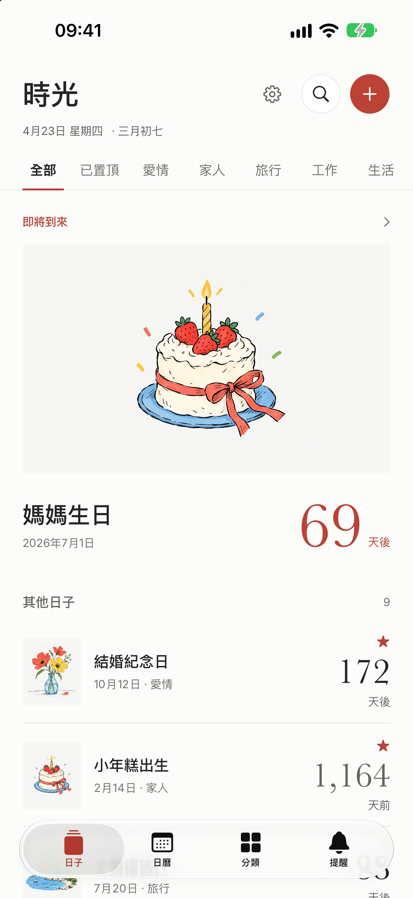

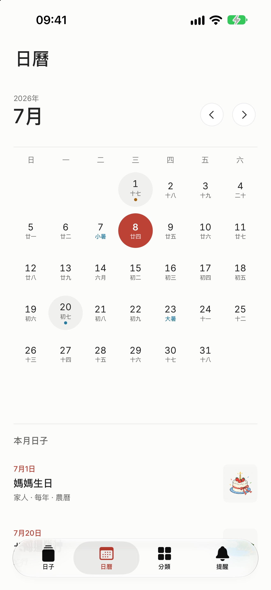
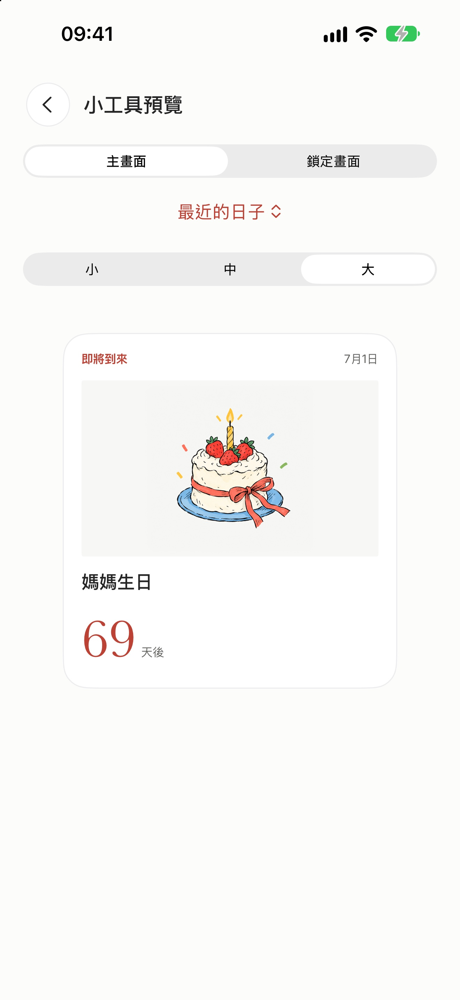


</p>

**English**

<p>
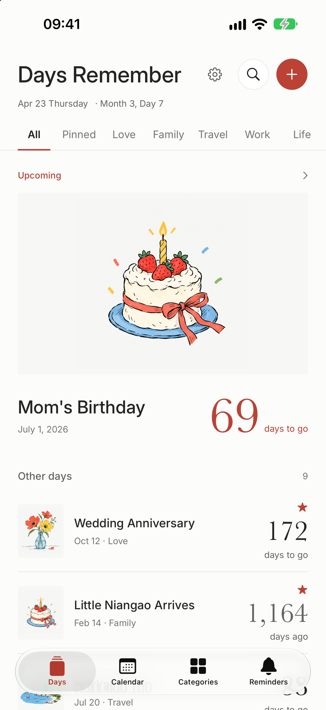
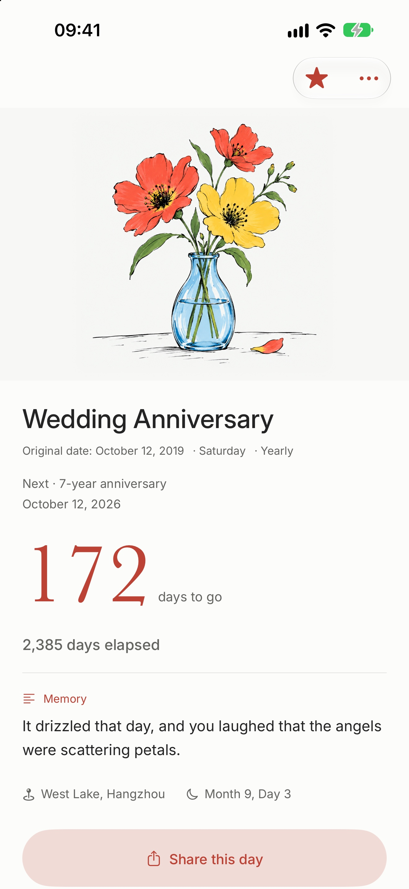
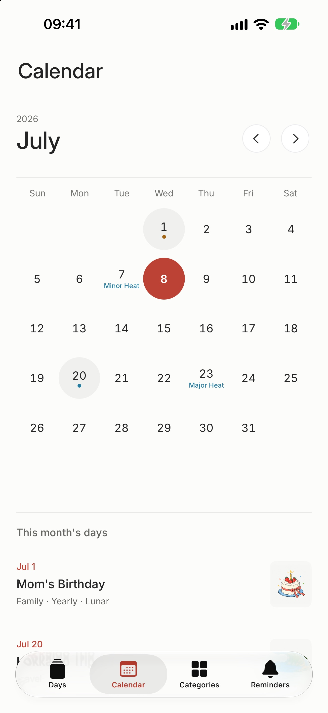
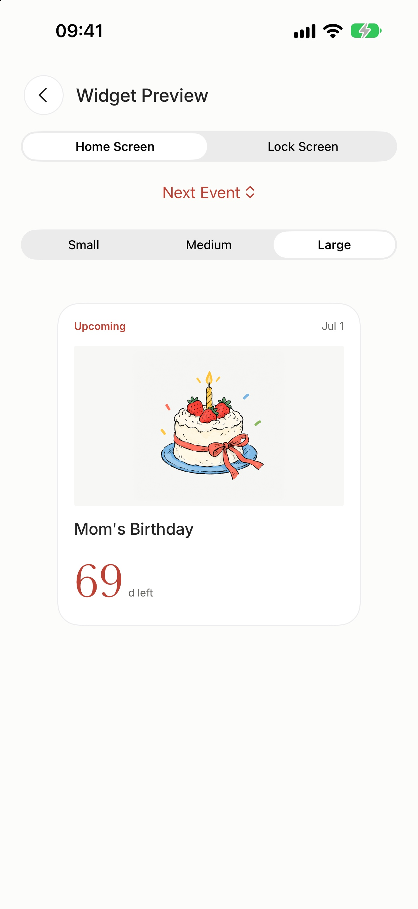
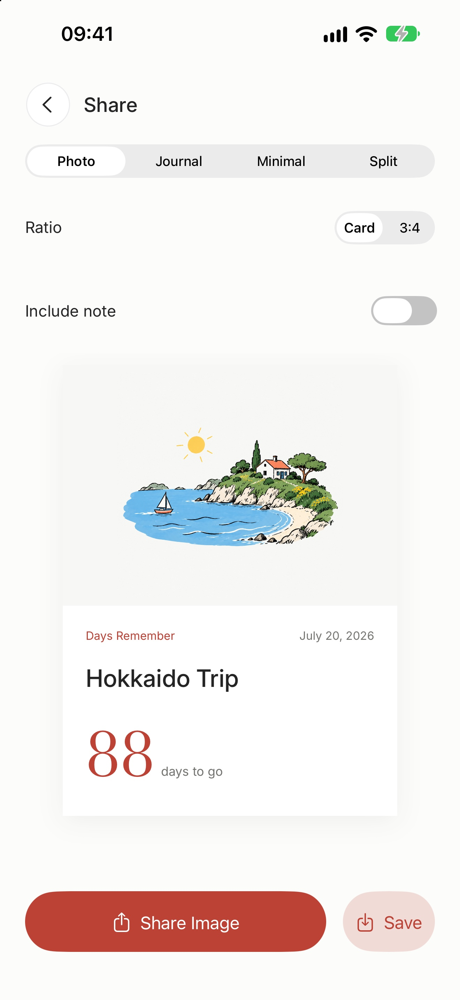
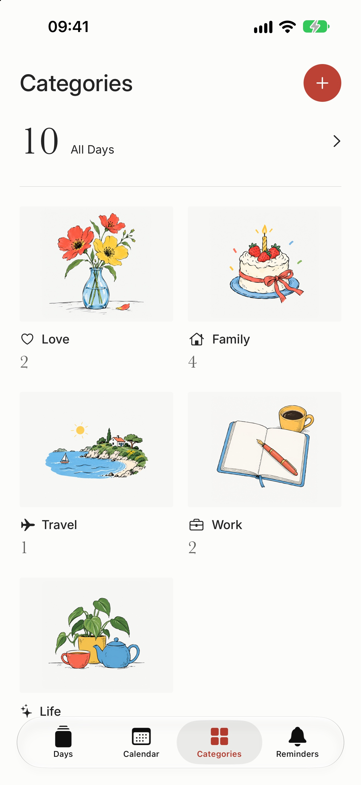
</p>

## Website

`docs/` is also the product site, <https://days.gooday.dev>. Cloudflare Workers Builds deploys it as static assets on each push to `main`, configured by `wrangler.jsonc` (no Worker code, no build step); preview it with `python3 -m http.server --directory docs`. It has a product page in Simplified Chinese (`index.html`), Traditional Chinese (`zh-Hant/`), and English (`en/`), plus the privacy policy (`privacy/`) and support page (`support/`) used as the App Store Connect URLs. Those two pages hold all three languages, each under its own anchor (`#zh-Hans`, `#zh-Hant`, `#en`), and Settings › About links to the anchor for the app language. The pages are static HTML with shared `assets/site.css` and `assets/site.js` and use system fonts only, since Google Fonts does not load in mainland China. The countdown demo counts in Beijing time, like the app.

## Languages

Open **Settings** (the gear on the home screen) and choose **Language**, then select System Default, Simplified Chinese, Traditional Chinese, or English and tap Done. The choice applies immediately and persists only on this device, shared with its widgets; scheduled reminder text is refreshed as well. System Default follows iOS's preferred app language, including the per-app language setting in iOS Settings. System-owned UI such as permission prompts and the Home Screen app name continues to follow iOS language settings.

Native String Catalogs under `Resources/Localization` are shared by the app and widget. The resolved bundle and locale are cached per language and region. Dates follow the selected language and the user's region; day boundaries and reminder times remain based on Beijing time. English countdowns and reminder counts use native plural rules. User titles, notes, locations, custom categories, and persisted system-category identifiers/names are never translated or rewritten. Language preferences are not part of backups or iCloud sync.

## OS integrations

| Capability | Wiring |
|---|---|
| **Local notifications** | `Store/NotificationManager.swift` schedules date-specific requests via `UNUserNotificationCenter`. Permission is requested when saving a day with reminders or explicitly enabling reminders, not on launch. Gregorian/lunar occurrences are planned up to five years ahead, retaining the earliest 64 requests including the optional daily greeting. The reminder page reads actual pending requests and their latest date; opening the app replenishes this finite schedule. Reminders fire at the chosen time on their own day; the optional daily greeting has its own time (08:00 by default). |
| **iCloud / backup** | `CloudLibrarySync` uses native `CKSyncEngine`, a private custom zone, separate day/category records, and `CKAsset` photos. Pending edits, record change tags, and the engine cursor are checkpointed locally. Data management (Settings › Data and Sync) offers JSON export/import, a pre-replacement recovery copy, and local recently deleted records. |
| **WidgetKit** | `DaysRememberWidget/` supports Small / Medium / Large Home Screen widgets and Circular / Rectangular / Inline Lock Screen widgets. Native configuration selects a specific day (including past days), or defaults to the nearest upcoming day, falling back to the most recent past day when nothing is ahead. Reads day metadata through the `group.com.shiguang.daysremember` App Group and loads only the photos of displayed days (none for Lock Screen layouts); each timeline includes the next seven midnights and resolves automatic selection for each date. The app reloads timelines when records change. Tapping a widget opens its day. |
| **PhotosPicker** | `DayEditorView` offers artwork presets and a photo picker. Photos are JPEG-compressed (max 1600px), stored on `Day.photoData`, and framed using `coverFocusX/Y`. `PhotoTile(day:)` shares that crop across the app and widget. |
| **Share sheet** | `ShareCardView` renders one of four templates via `ImageRenderer`, at the card's own height or as a 3:4 portrait image, at no less than 3x; private notes are excluded unless explicitly enabled. 分享图片 opens `UIActivityViewController`; 保存 writes to Photos via `PHPhotoLibrary` (requires `NSPhotoLibraryAddUsageDescription`). |

Out of scope: WeChat-/小红书-specific SDK integrations are intentionally not wired — the system share sheet routes to whatever messaging apps the user has installed.

## Build

This project uses [XcodeGen](https://github.com/yonaskolb/XcodeGen) to generate `DaysRemember.xcodeproj` from `project.yml`.

```sh
brew install xcodegen
xcodegen generate
open DaysRemember.xcodeproj
```

Then choose an available iPhone simulator (iOS 17+).

## Data and CloudKit

New installations start empty; daily greetings and annual memories are opt-in. Existing local records, photos, categories, and saved preferences are retained. Recurring days show both elapsed days since the original date (from the day after it; the original date itself reads 今天) and the next anniversary.

The app refreshes its shared calendar day at midnight, on foreground entry, and after significant system time changes. Countdown, calendar, category, share, and widget-preview views observe that date without resetting navigation or in-progress editor state.

Editors with unsaved changes or a photo import in progress block swipe dismissal. Cancel offers an explicit discard confirmation; unchanged drafts close directly. Drafts remain local to the open editor and are not promised to survive app termination.

Lunar dates can be entered directly by year, month (including valid leap months), and day, with the Gregorian counterpart shown before confirmation. Switching to a shorter month clamps the day; a missing leap month falls back to the same regular month. Cancelling leaves the original date unchanged. Entry is limited to lunar years 1900-2100; older out-of-range records remain unchanged and show a range warning.

The calendar shows lunar days beneath Chinese date numbers, starts weeks on the user's first weekday (including the iOS Language & Region override), changes month with a horizontal swipe, and opens a new day prefilled with any empty date. Solar terms are solved from a truncated VSOP87 solar series and dated in Beijing time, matching published equinoxes and solstices to about a minute; traditional festivals skip leap months and include 除夕.

Each day can follow global reminders, disable them, or select multiple advance offsets with an optional Beijing-time override. Existing imported offsets remain editable. The override also applies to annual memories. Reminder-sheet changes take effect only after confirming the sheet and saving the day; cancellation preserves the original settings. Older records without a time override continue using the global time.

Active photos are stored as immutable SHA-256-addressed files in the App Group. `days.v2` contains only metadata and photo references; the original `days.v1` bytes remain untouched for recovery. The widget reads the same files. Missing or modified photo files stop normal writes and remain available through original-data export. Failed saves keep the editor open. CloudKit checkpoints use the same local photo-file format in their own directory, preserving the old checkpoint. Portable JSON backups still contain complete photos, including trash and retained sync versions.

`PersistencePerformanceTests` measures 10/100/1000 distinct 126 KiB JPEGs in isolated storage. On the QA simulator (Debug, three-run medians), 100-record title updates changed from 68.4 ms to 3.9 ms and warm loads from 54.7 ms to 19.4 ms. At 1000 records, updates changed from 892.4 ms to 129.8 ms and loads from 579.8 ms to 194.3 ms; one-time photo migration took 776.2 ms. These are local warm-storage measurements, not device launch or fsync guarantees. The 1000-photo backup exceeds the existing 100 MiB limit and is refused. Old preference snapshots and unreferenced immutable photos are intentionally retained; disk compaction is not part of this change.

Before enabling CloudKit for the first time, the app preserves a local migration backup of any existing library; a new, empty installation keeps none. Legacy `NSUbiquitousKeyValueStore` day/category keys remain untouched and are no longer written. When those keys hold records this device has not seen, the data page offers to append them without overwriting matching IDs; upgrade all devices before further edits. This is a one-way migration, not ongoing interoperability with old clients. Small notification preferences continue using KVS.

Cloud updates merge by record ID. Before replacing conflicting local content, the app keeps a recoverable local snapshot. Account changes pause uploads until explicitly confirmed; a deleted server zone is not automatically recreated. Recently deleted records and recovery copies are device-local; recently deleted days stay for 30 days, and deleting offers an immediate undo. Exported JSON includes photos and is not encrypted; the current backup size limit is 100 MB. Invalid imports or unreadable local data do not silently reset the library.

Local versions replaced by cloud records are retained separately by record and version for 30 days, so later remote changes cannot overwrite them. Deleted days and these versions store photos in the same file-backed format as active days rather than inline in shared defaults. Data management can preview, restore, or discard a single saved version without rolling back other records. Backup format v2 includes these device-local versions and still imports v1 backups.

For real iCloud operation, set `DEVELOPMENT_TEAM` in `project.yml`, enable the App Group, iCloud/CloudKit and Push Notifications capabilities, and associate `iCloud.com.shiguang.daysremember` with the app identifier. The project includes remote-notification background mode. Follow Apple's [CKSyncEngine sample setup](https://github.com/apple/sample-cloudkit-sync-engine), then deploy the CloudKit schema to Production before distributing a production build. Simulator builds intentionally do not connect to CloudKit and display a configuration notice; local features remain available. Simulator/unit checks do not verify provisioning, APNs, production schema, or two-device delivery; validate these on signed devices using the intended iCloud account.

## UI and tests

The visual system uses an off-white canvas, ink typography, restrained vermilion accents, and an editorial layout. `Theme/Tokens.swift` provides scalable Inter/system text and Baskerville countdown numerals. Bundled AI-generated colorful hand-drawn presets use loose black outlines and clean paper backgrounds whose edges feather into the cover fill; a new day's cover follows its system category until a template or photo is chosen. User-selected photos still take precedence. Shared controls live in `Views/Components/Controls.swift`; `Theme/DayWidgetCard.swift` is used by both WidgetKit and the in-app gallery. Persisted category and cover identifiers remain compatible with existing data.

`Theme/DayAccessoryWidget.swift` shares the Lock Screen layouts with the gallery. Lock Screen content uses system monochrome styling and excludes photos and notes. Compact circular layouts prioritize the count and direction; compact rectangular layouts omit the secondary date when needed. VoiceOver retains the full title, direction, count, and occurrence date, including when visible text is truncated. The gallery offers both Home Screen and Lock Screen styles; rendering tests cover 56-point and larger bounds, large counts, and empty/deleted states.

`DaysRememberTests` covers dates, lunar recurrence, persistence, settings, image crops, share rendering, and widget rendering. `DaysRememberUITests` exercises navigation, search, day CRUD across relaunch, category editing, system sharing, widget previews, and large accessibility text. Run `xcodebuild test -project DaysRemember.xcodeproj -scheme DaysRemember -destination 'platform=iOS Simulator,id=<UDID>'`. Simulator builds use local ad-hoc signing; do not disable signing for integration tests, because App Group registration and App Intents widgets depend on the simulated entitlements. This does not replace developer provisioning for physical devices.

Use a dedicated test simulator: UI fixtures deliberately reset its library. Backup, migration, CloudKit record/state, and notification planning tests run without a live cloud account. Automated debug launches suppress cloud operations and notification permission prompts.

### Continuous integration

[iOS CI](.github/workflows/ci.yml) runs on pushes, pull requests, and manual dispatches with Xcode 26.6 on a macOS 26 runner. It generates the Xcode project, runs unit tests and application UI tests with coverage, then builds the app and widget in Release for the simulator. No signing certificates or cloud credentials are required; simulator ad-hoc signing remains enabled.

Run the same entry point locally with Xcode, XcodeGen, and `jq` installed:

```sh
bash scripts/ci.sh
```

The script creates a disposable iPhone 17 simulator and deletes only that device on exit, including test failures. It does not reset existing simulators. Locally it selects the newest installed iOS runtime; `IOS_RUNTIME` and `IOS_DEVICE_TYPE` can select another installed runtime and compatible device type. The workflow pins both for reproducibility.

Logs, line coverage (`coverage.json`), and test results with XCTest attachments (`Tests.xcresult`) are saved under `build/ci/run.*` and uploaded by CI for 14 days, including failed-test results. Open an `.xcresult` in Xcode to inspect failures and screenshots. Coverage is reported without an arbitrary pass threshold.

The `DaysRememberCI` scheme skips only `WidgetHomeUITests`, which depends on a manually configured Home Screen. Both application widget galleries and widget rendering tests remain covered. The regular `DaysRemember` scheme retains the manual Home Screen test. CI does not validate device provisioning, live CloudKit sync, APNs, or App Store archives.

The test scheme defaults to Simplified Chinese for existing regression assertions. Run `LocalizationTests` with `-testLanguage en -testRegion US` and `-testLanguage zh-Hant -testRegion TW` to check each language's runtime strings, plural rules, reminder payloads, and widget accessibility. `LocalizationUITests` covers English editors, large-text share/widget layouts, and persistent user content across a Traditional Chinese relaunch.

`LanguagePreferencesTests` uses isolated defaults to cover the local language preference and bundle selection. `LanguagePreferencesUITests` covers in-app switching, cancellation, relaunch persistence, data preservation, and the language sheet at the largest Dynamic Type size; teardown restores System Default and normal text size.

## Debug launch arguments

For inspecting individual screens without manual navigation, the app reads a few launch arguments (debug only — production launches ignore them):

```sh
# Pin "today" to 2026-04-23 (the prototype's reference date) so countdowns match the design.
# (`SIMCTL_CHILD_*` env vars are forwarded to the launched app by simctl.)
SIMCTL_CHILD_DR_PIN_TODAY=1 xcrun simctl launch <device> com.shiguang.daysremember

# Open a specific tab on launch
xcrun simctl launch <device> com.shiguang.daysremember --tab calendar         # home | calendar | categories | notifications

# Dedicated test simulators only: replace the library with explicit fixtures
xcrun simctl launch <device> com.shiguang.daysremember --seed-sample-data --tab home
# …with the samples translated into the app's current language (store screenshots only)
xcrun simctl launch <device> com.shiguang.daysremember -AppleLanguages "(en)" --seed-sample-data --localized-samples
xcrun simctl launch <device> com.shiguang.daysremember --empty-library --show-onboarding

# Open a specific screen directly (bypasses the tab shell)
xcrun simctl launch <device> com.shiguang.daysremember --screen detail --day wedding
xcrun simctl launch <device> com.shiguang.daysremember --screen add
xcrun simctl launch <device> com.shiguang.daysremember --screen share --day japan
xcrun simctl launch <device> com.shiguang.daysremember --screen widgets --widget-size large   # small | medium | large
xcrun simctl launch <device> com.shiguang.daysremember --screen onboarding
```

`--day` accepts any sample id from `Models/SampleData.swift` (`wedding`, `baby`, `birthday`, `midautumn`, `japan`, `kaoyan`, `firstmet`, `work`, `dog`, `moved`).
